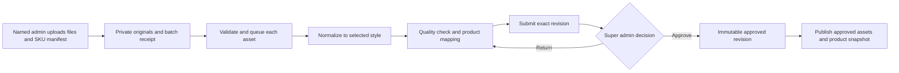
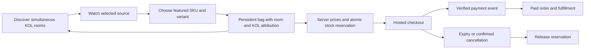

# iSunTVMall backend plan

25 September 2026 · Implementation state and remaining launch plan · [Traditional Chinese](BACKEND-PLAN.zh-Hant.md)

## Product decision

Keep the current **muji** storefront. Build one merchant's commerce backend around many independent KOL rooms: each host broadcasts on an authorized source, each room has its own approved assortment, and every room shares the same inventory and checkout. Buyers keep their bag when changing rooms. Start with supported YouTube playback and explicit source links; enable other embedded providers only after their account and playback requirements pass verification.

“Mirror” means displaying an authorized provider player. It does not mean capturing, proxying or retransmitting another platform's video. Instagram Live playback inside our site is **UNKNOWN**, so its initial experience opens Instagram while preserving the shopping bag. A supported original feed supplied by the KOL could later support our own player; that is a separate authorized integration, not extraction from Instagram.

The source now includes six named staff roles, privileged-role MFA, fresh session/membership revocation checks, invitation and password-setup flows, private live revisions, verified publication and product pins, scoped order operations, reports and durable batch capacity. These are implemented foundations, not activated merchant services. Production identity, migrations, storage, worker installation, provider playback and payment proof remain **UNKNOWN/HOLD**. Real checkout remains disabled.

## Existing evidence and work still required

| Area | Evidence inspected | Required next step |
|---|---|---|
| SHOPLINE reference | The 23 September audit observed product/variant forms, bulk actions, design controls, source-specific live setup, order filters, checkout settings and affiliate commission options. | Reuse the workflow ideas; build our independent implementation. |
| SHOPLINE verification limit | Test store had zero products; import and payment selectors were disabled. No stream, order, payment or affiliate campaign was completed. Instagram professional account was not connected. | Batch persistence, simultaneous KOL capacity, partner permissions, payment lifecycle and independent embedding remain **UNKNOWN**. Visible menus are not proof. |
| Current storefront | Source contains 96 demo products, 17 holiday collections, language switching, room pages and a persistent attributed bag. | Replace demo products only with approved merchandise and verified commercial facts. |
| Current admin | Named Supabase authentication uses six roles. Super admin, operator and order operator require verified `aal2` MFA. Every request checks current identity, session existence/revocation and active membership. Team APIs support role/KOL assignment and invitations; invite acceptance sets a password and then requires a fresh sign-in. | Provision actual staff identities and first owner safely; verify MFA, invitation delivery/redirect and revocation against the real project. No invitation was sent as proof of this implementation. Legacy shared-password tokens do not authorize the new backend. |
| Current media path | Private original/processed buckets, scoped previews, image normalization, leased jobs, revision-bound super-admin approval and transactional new-product publication exist. Legacy direct product/import/upload endpoints return 410 unconditionally. Capacity admission reserves original and derivative budgets. | Apply and verify remote migrations/policies, inventory retained objects, provision staff, set approved budgets, install the single scheduled worker and run storage/approval/publication smoke tests. `BATCH_HELPER_ENABLED` remains a separate activation gate. |
| Current live operations | Separate private draft revisions, own-KOL edit/request scopes, operator/super-admin source verification and atomic room/rail publication, live product pins and five-second public polling exist. Public queries require `is_public` and an active host. | Verify actual authorized broadcasts on the production domain. A producer's recorded check is required and bound to a revision; it is not automatic platform certification. |
| Current orders and reporting | Role-scoped, paginated order reads; separate support/fulfillment assignments; paid-order packing/shipping/delivery; refund request and super-admin review; revision/idempotency guards and audit records. Overview exposes aggregate or own-KOL results without buyer records to analysts/KOLs. | Rehearse with real provider test events and fulfillment staff. Refund approval does not transfer funds, change payment state or restock inventory; financial refund execution remains separate. |
| Current settings | Super-admin-only read-only readiness page shows configuration presence and explicit unverified requirements. It never reveals credentials or writes settings. | Approve actual shipping rates/destinations, tax handling, refund/contact policies and operating owner before checkout opens. Configuration presence is not a passed connection test. |
| Current checkout source | Stripe hosted-checkout code and SQL include reservations, server prices, line attribution, event deduplication, expiry and payment-review states. | Run migrations and lifecycle tests in an authorized database/payment environment. Current `checkoutReleaseReady()` returns `false`; real checkout stays closed. |
| Current inventory scale | Reservation SQL uses a shared transaction lock and product stock; a product currently represents one SKU. | Verify last-unit concurrency before pilot. Add Product → SKU variants without rebuilding unrelated code. Measure contention before replacing the simple lock. |

Source review: `src/lib/staff/`, `src/lib/live/operations.ts`, `src/lib/live/operations-schema.ts`, `src/lib/orders/`, `src/app/api/admin/`, `src/app/admin/(protected)/settings/page.tsx`, `batch_helper/`, `supabase/migrations/`, and existing checkout code. Historical SHOPLINE evidence remains in its separate audit; its old deployment/auth observations do not describe today's source or deployment.

## Suggested staff roles

Use named accounts and permissions rather than a long hierarchy of increasingly powerful admins. The job functions below are the recommended organization; the following permission matrix states the narrower implemented foundation. Variants, financial refund execution, label purchasing and policy editing are not implied by these job titles.

| Job function | Appropriate responsibility | Boundary |
|---|---|---|
| Owner / super admin | Team access, store settings, final product/image approval, payment settings, refunds and emergency withdrawal | Keep this small; require MFA and recent authentication for sensitive changes. |
| Operations manager | Day-to-day catalog coordination, schedule, exception queues and approved campaigns | Cannot grant roles or approve their own uploaded merchandise. |
| Catalog editor | Product text, variants, prices, draft imports and submission | Cannot publish or change payment settings. |
| Media operator | Upload, select style, review images and resolve processing errors | Cannot approve images or change commercial facts. |
| Livestream producer | Prepare rooms, assign approved SKUs, validate sources, pin products and end sessions | No payment credentials or unrestricted customer data. |
| KOL / creator | Own profile drafts, own assigned rooms, approved product selection and own aggregate results | Cannot access another KOL's rooms, private stock costs or buyer contact details. |
| Customer support | Assigned orders, buyer enquiries and refund requests | Cannot execute refunds or export the customer database. |
| Fulfillment operator | Paid-order packing, shipping labels and tracking | Only necessary delivery details; no payment settings. |
| Finance | Reconciliation, refund review and eventual commission reports | Refund execution requires an explicit grant; no automated creator payouts in V1. |
| Analyst | Aggregated product, room and sales reporting | Read-only; no buyer identity by default. |

### Six implemented permission presets

All six presets now exist in the authorization code and schema: `super_admin`, `operator`, `catalog_editor`, `kol`, `order_operator`, `analyst`. Media staff use catalog editor; producers use operator; support and fulfillment share order operator with separate per-order task assignments. The owner handles finance review initially. These roles still need actual account provisioning; specialized roles can be split later.

| Permission | Super admin | Operator | Catalog editor | KOL | Order operator | Analyst |
|---|---|---|---|---|---|---|
| Invite, change membership, revoke access | Yes | No | No | No | No | No |
| View store readiness (no settings edits) | Yes | No | No | No | No | No |
| Upload/process/edit merchandise drafts | All batches | Own batches | Own batches | Own batches | No | No |
| Approve and publish merchandise | Yes | No | No | No | No | No |
| Prepare rooms and approved SKU rails | Yes | Store | No | Own rooms | No | No |
| Publish room / change source | Yes | Store | No | Request only | No | No |
| Pin SKU during a published room | Yes | Store | No | Own approved rail | No | No |
| Read customer/order details | Yes | Masked exceptions | No | No | Assigned task scope | No |
| Dispatch / tracking | Yes | No | No | No | Fulfillment scope | No |
| Review refund requests | Yes | No | No | No | Support scope requests | No |
| Execute financial refund / edit payment settings | Not implemented | No | No | No | No | No |
| Aggregate reports | Store | Store | Catalog and own batch counts | Own KOL | Assigned queue | Store |

Implemented routes validate named staff and call deny-by-default permission checks; SQL operations independently recheck active roles and KOL/order scope. Caller-supplied role or approval flags have no authority. Current isolation is one merchant/store with KOL, batch-owner and order-assignment scopes; a multi-store `store_id` tenancy model remains a later generalization.

Super admin, operator and order operator require MFA. Sign-out records the current session ID in the server revocation table before clearing cookies; membership/session validity is rechecked on later requests. This is current-session revocation, not a claim to sign every device out globally. Invitation delivery alone grants no access: a valid membership and accepted sign-in are required; pending/failed membership is recorded. Never return secrets or full buyer payloads in audit events. Existing signed media URLs remain usable only until their short expiry, even if membership is revoked; new URL requests are denied immediately.

## Backend navigation and working screens

Use the same restrained spacing, colors and language switch as the storefront. Keep the task and its next action prominent.

1. **Overview / analytics:** implemented catalog/room/batch counts, masked operational exceptions, currency-separated paid-order aggregates and own-KOL attribution. No fake revenue, viewer counts or payment events.
2. **Catalog / media studio:** implemented read views and the batch workflow, original/output comparison, six styles with muji default, explicit file-to-SKU metadata and bilingual merchandise copy. Multi-image variants and existing-product revision editing are deferred.
3. **Approvals:** implemented super-admin item or bounded batch approval bound to reviewed versions, return notes and stale-revision rejection.
4. **Live studio:** implemented private room drafts, ordered approved merchandise, source preview/check, publication requests, operator publication and current product pin. A visual calendar and automated channel discovery remain later additions.
5. **Orders:** implemented scoped search/queues, separate payment and fulfillment state, packing/tracking/delivery and refund requests/review. No automated carrier purchase or financial refund execution.
6. **Team and hosts:** implemented super-admin team membership/invitation flow, role/KOL binding and host management. KOL self-service profile authoring remains a later addition.
7. **Settings:** implemented read-only, owner-only readiness. Actual policies, shipping settings and payment credential management remain outside this interface and unresolved for commercial activation.

## Merchandise batch helper: production contract

The repository's `batch_helper` now has a deterministic image engine plus the named-user API, review UI and SQL queue foundation. **Implemented V1 scope: one selected image becomes one NEW product draft, at most 1,000 records per batch.** Existing SKUs are never overwritten. Filename-to-SKU CSV supplies explicit commercial metadata, or an editor must complete every field before review; filenames alone do not establish sellable facts. Multi-image grouping, variants and existing-product revision updates remain deferred. The public workspace is a clearly marked preview while online provisioning is UNKNOWN/HOLD. The following flow is implemented in source; runtime completion still requires provisioning and smoke tests:

- **Intake:** V1 uploads whole files directly into private storage and resumes a batch by skipping completed uploads after the original files are reselected; large-file TUS/chunk-level resume is deferred. Record original filename, uploader, explicit SKU metadata and hashes computed by the worker. Validate image signatures, decoded dimensions/pixel limits and allowed formats. A thousand images create at most a thousand review drafts under the explicit one-image rule, never automatically approved products; missing English/Traditional Chinese titles/descriptions or prices block approval. General multi-image grouping is a later target.
- **Transformation:** rotate from orientation metadata, fit without cutting away the product, apply profile background/canvas, export a 1,600 px WebP and strip unnecessary metadata. Preserve the original. Style may change presentation, never the product's actual color, shape, label, quantity or material. There is no generative retouching or background removal in V1; any future such operation needs explicit provenance and review.
- **Scale and capacity:** persisted jobs use immutable outputs, revision guards, ten-minute leases and at most three claims before manual recovery. Creation binds a stable request UUID to an exact payload. Admission defaults: 1,000 items / 512 MiB declared input per batch; 1,000 outstanding items per actor / 3,000 store-wide; 32 GiB retained reservation per actor / 50 GiB store-wide. Each original reserves the full 24 MiB upload ceiling, with exact derivative/public-copy reservations. Publishing frees queue capacity, never retained-storage allowance. These are conservative operating limits, not purchased capacity or measured disk use. Super-admin changes are audited; automatic deletion/quota release is absent.
- **Worker runtime:** HTTP byte caps and deadlines, bounded executions, single-runner locking, crash recovery, bounded health snapshots and a deployment template/runbook exist. No scheduler is installed by those files. Reconcile pre-existing objects and approved budget, run a bounded staging batch, then activate one named Studio worker. Full remote throughput and genuine multi-connection database races still require verification.
- **Approval:** implemented approval binds a named active super admin to the exact item revision, whose product metadata and source/output hashes are stored server-side; draft edits clear approval. The worker rechecks approver activity and output bytes before publication. A canonical aggregate manifest hash is an optional later audit enhancement. V1 does not edit published products; future product revisioning must leave the previous approved snapshot live while the next draft is reviewed. Operational stock changes remain separate audited transactions.
- **Publication:** the worker copies an approved derivative to public delivery, verifies its bytes, then the SQL transaction rechecks approval/revision and inserts the new product plus image. It refuses existing SKUs. A failed/revoked publication can leave an unlisted approved-image copy; originals remain private and cleanup is separate. Legacy direct catalog writes are now retired with HTTP 410 regardless of the batch flag. Existing-product rollback and revision publication remain planned. Never include upload data in GitHub.
- **Acceptance:** a 1,000-file test batch must survive interrupted upload, worker restart and duplicate delivery; every file has exactly one terminal result and every intended SKU mapping is accounted for. A regular admin's publish attempt fails. A changed image invalidates earlier approval. One damaged file does not erase the other results. Throughput/cost remain **UNKNOWN** until measured on the selected runtime; define the service target after that benchmark.

## Livestream capability policy

| Provider | V1 behavior | Current evidence / remaining gate |
|---|---|---|
| YouTube | Authorized public or otherwise embeddable video ID in the official player; source-link fallback | Official player documentation verified on 25 September. Actual KOL content, live eligibility, embedding permission and domain/browser playback still need a real account test. |
| Facebook | Conditional official embedded player with source-link fallback | Adapter code exists. Official Meta documentation endpoints returned HTTP 429 during this review; current account/live constraints and successful playback are **UNKNOWN**. Do not advertise this as verified until tested. |
| Instagram | Open the official broadcast in a new tab/app, keep our room and bag available | No current official Live embedding support was verified. Public post/reel embedding would not establish Live playback. Do not scrape video URLs or treat an account connection as proof. |
| Other sources | External link by default; add explicit provider adapter after a bounded test | Recorded-video embeds are not evidence of LIVE support. Owner-supplied direct feeds require a separate supported ingestion/player design. |

For YouTube, keep merchandise beside/below the player, never over its controls; provide the required referrer identity, retain branding, minimum 200 × 200 player area, and at most one automatically playing YouTube player per page. See [required player functionality](https://developers.google.com/youtube/terms/required-minimum-functionality). Handle private/unavailable videos, disabled embedding and identity failures visibly; see [IFrame API](https://developers.google.com/youtube/iframe_api_reference). Provider and network buffering introduce delay: do not promise zero latency or frame-synchronized product pinning.

The implemented source-check record binds provider/URL/ID, viewing method, rights/playback attestations, tested domain, device note, checker and time to the draft revision. Publication requires a check from an active operator/super admin within 24 hours, non-demo published merchandise and an active KOL. Any saved edit requires a new check. KOLs can prepare/request their own rooms and pin only their published rail; saved-source changes and publication require operator/super admin. Draft edits do not leak to viewers; room and rail commit together. Poll responses exclude checks, staff identities and draft content, and stale revisions cannot undo newer pins.

Automated discovery, provider OAuth, live chat and comment-to-order remain later integrations. Official Meta references attempted: [Facebook embedded video](https://developers.facebook.com/docs/plugins/embedded-video-player/) and [Instagram oEmbed](https://developers.facebook.com/docs/instagram-platform/oembed/); their current contents were not retrieved successfully.

## Customer flow and commerce invariants

Current room polling changes the merchandise selection without remounting the player; the bag persists between rooms. A changed broadcast offers an explicit reload. The diagram includes the intended payment journey, which remains closed in production; returning from paid checkout to the originating room and mobile resume behavior must be verified during payment activation.

Use integer minor-unit prices and one currency per order. Keep immutable order-line title, SKU, price, tax/shipping totals and validated KOL/room attribution. Two rooms selling the last unit must share one atomic reservation. Duplicate checkout requests and payment webhooks must not create duplicate orders or consume stock twice. Do not release inventory merely because the buyer reaches a cancel page; reconcile the provider's state. Route late payment, amount mismatch, disputed or refunded events to review. Only a verified paid order becomes fulfillable. Refunds and stock returns are separate decisions. V1 is one merchant and centrally fulfilled; commission reports later use settled sales minus refunds, with approved rule snapshots and no automatic payouts.

## Data model and service boundaries

Reuse the existing application and relational transactions. The table is the generalizable target model, not a claim that each conceptual entity already has its own table. Current implementation uses `staff_members` plus session/invitation/audit records; `live_room_drafts`, `live_source_checks`, `live_room_state`; batch item/job/capacity records; and scoped order assignments/refund requests. Separate SKU variants, tenant grants and commission entries remain deferred.

| Entity group | Core relationships / invariant |
|---|---|
| Store, User, Membership, PermissionGrant | Named user belongs to store; grants include action and resource scope; revoked sessions stop working. |
| KOL, Channel, LiveSession, StreamSource | KOL owns channels and rooms; source capability/authorization independent of room status. |
| Product, SKU, ProductRevision | Product holds localized content; SKU holds sellable options and inventory key; publication points to immutable approved revision. |
| MediaBatch, MediaAsset, TransformJob, StyleVersion | Asset belongs to batch/SKU; private original and derivative hashes; jobs are resumable and idempotent. |
| Approval, Publication, AuditEvent | Approval binds actor and revision/hash; publication references that approval; every mutation has a trace. |
| LiveProduct, PinEvent | Room's approved SKUs and ordered rail; monotonically increasing event revision prevents stale pin changes. |
| Cart, CartLine | SKU/quantity plus room/KOL context; server validates relationships; no client-supplied price authority. |
| InventoryReservation, Order, OrderItem | Shared SKU stock; expiring holds; immutable order snapshots and explicit lifecycle. |
| PaymentEvent, Fulfillment, RefundRequest | Unique provider event IDs; finance and shipping states separate; restricted personal data. |
| CommissionEntry (later) | Order-line beneficiary and rule snapshot; reversed/refunded amounts preserved rather than overwritten. |

Implemented architecture: Cloudflare storefront/API code, relational transaction adapters, private-object workflow, approved public derivatives, durable SQL job/capacity records and an image worker with a prepared scheduled runner. Product pins use five-second polling and monotonic revisions. Add push transport only when measured experience warrants it. Provider account secrets stay in the runtime secret store. Asset transformations run outside request timeouts. Database and queue availability, costs and production credentials are not established by this plan.

## Delivery plan to 30 September

The software foundations below are now implemented and locally checked; remaining dates are activation targets, not claims of completion. Aim for a controlled pilot by 29 September, leaving 30 September for fixes. External approvals cannot be guaranteed by a software schedule.

| Target date | Deliverable | Measurable exit gate |
|---|---|---|
| 25–26 September | Preserve six style profiles, muji default; complete local verification of the six-role/live/order/batch foundations | Profile selection works; originals preserved; processed revision review is reproducible; no public publish by a regular uploader. |
| 26–27 September | Provision named identities, MFA/invitation delivery, storage/queue and one worker | Automated cross-role/cross-KOL denial tests; revoked session denied; changed revision cannot use stale approval; source rollback is rehearsed. Existing-product rollback is deferred. |
| 27–28 September | Activate verified KOL rooms using the implemented live studio | Two authorized hosts run concurrently with distinct rails; bag survives switching; source failure leaves shopping usable; each enabled provider has recorded playback evidence. |
| 28–29 September | Connect payment/database staging and rehearse implemented order operations | Last-unit race produces at most one reservation; repeated webhook creates one paid order; expiry, uncertain checkout, mismatch and refund-review paths pass; shipping quote and policy are approved. |
| 29 September | Controlled production pilot if all gates pass | Approved real products, actual source permissions, configured merchant account, successful bounded end-to-end purchase/refund, fulfillment rehearsal, mobile inspection and rollback receipt. |
| 30 September | Stabilize and decide next increment | Resolve pilot defects; publish operational owner/runbook and measured queue results. If a gate remains missing, retain preview/disabled payment with its exact blocker documented. |

**Dependencies currently UNKNOWN:** provisioned per-user identity/MFA, authorized production database migration status, private media storage/queue and benchmark, real merchandise ownership/specifications/allergens/stock, KOL permissions and channel playback, payment merchant onboarding and lifecycle results, shipping/tax/refund/contact rules, fulfillment owner and service targets. Software work can proceed with controlled fixtures; real sales and unverified providers remain gated independently.

**Deferred:** universal social chat, comment-to-order, native transcoding or restreaming, multi-merchant settlement, automatic KOL payouts, personalized buyer uploads and advanced promotion engines. The first useful backend is approved catalog → verified rooms → reliable orders, with accountable people at each step.

## Evidence and activation boundary

The repository includes focused application and local database tests for permissions, source/rail publication, monotonic pins, order scope and transitions, batch leases/revisions/capacity and worker failure paths. The owning release receipt records final test counts and source hashes; earlier benchmark/test totals are not repeated here as current full-suite results. A local synthetic-image benchmark does not measure network or production throughput. Local single-connection PostgreSQL tests do not prove multi-connection races.

No real invitation delivery, active staff login/MFA, remote migration/storage access, installed worker, actual provider broadcast or merchant payment lifecycle is established by these tests. Read-only settings must continue to show unresolved policies/shipping/worker evidence honestly. Production activation requires recorded end-to-end proof; real checkout remains disabled until its independent release gate is satisfied.

Native database follow-up: 11 assertions passed on disposable PostgreSQL 17.11 across five contention cases with eight simultaneous connections each: last-unit reservation, batch count cap, retained storage cap, order revision conflicts and idempotent retries. The temporary server was stopped. This closes those local concurrency checks only; managed Supabase, provider lifecycle and real account tests remain unverified.
