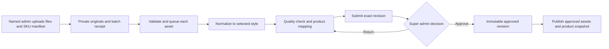
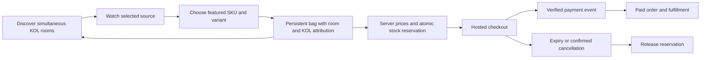

# iSunTVMall backend plan

25 September 2026 · Proposed implementation plan · [Traditional Chinese](BACKEND-PLAN.zh-Hant.md)

## Product decision

Keep the current **muji** storefront. Build one merchant's commerce backend around many independent KOL rooms: each host broadcasts on an authorized source, each room has its own approved assortment, and every room shares the same inventory and checkout. Buyers keep their bag when changing rooms. Start with supported YouTube playback and explicit source links; enable other embedded providers only after their account and playback requirements pass verification.

“Mirror” means displaying an authorized provider player. It does not mean capturing, proxying or retransmitting another platform's video. Instagram Live playback inside our site is **UNKNOWN**, so its initial experience opens Instagram while preserving the shopping bag. A supported original feed supplied by the KOL could later support our own player; that is a separate authorized integration, not extraction from Instagram.

This document separates the implemented batch foundation from the broader production-backend plan. Named-user batch authentication, two role checks, private-bucket migration, a leased queue and revision-bound approval now exist in source. Online provisioning remains UNKNOWN/HOLD: this does not claim that staff accounts, remote migrations, storage, workers, real KOL channels or payments are active.

## Existing evidence and work still required

| Area | Evidence inspected | Required next step |
|---|---|---|
| SHOPLINE reference | The 23 September audit observed product/variant forms, bulk actions, design controls, source-specific live setup, order filters, checkout settings and affiliate commission options. | Reuse the workflow ideas; build our independent implementation. |
| SHOPLINE verification limit | Test store had zero products; import and payment selectors were disabled. No stream, order, payment or affiliate campaign was completed. Instagram professional account was not connected. | Batch persistence, simultaneous KOL capacity, partner permissions, payment lifecycle and independent embedding remain **UNKNOWN**. Visible menus are not proof. |
| Current storefront | Source contains 96 demo products, 17 holiday collections, language switching, room pages and a persistent attributed bag. | Replace demo products only with approved merchandise and verified commercial facts. |
| Current admin | Legacy product/CSV, host, room and order screens use a shared-password session. The new batch service separately authenticates named Supabase users and reads active `catalog_editor` / `super_admin` membership on every operation; editors are scoped to their own batches. | Provision and test accounts, storage and worker execution. MFA, broader roles, store/KOL scopes and replacing legacy live/order authentication remain planned. A legacy shared password grants no batch approval authority. |
| Current media path | New code includes private intake/processed buckets, named-role access, short-lived previews, bounded image normalization, leased jobs, revision-bound super-admin approval and transactional new-product publication. Legacy upload/product/import APIs return 403 when `BATCH_HELPER_ENABLED=true`. | Keep the feature disabled until remote migration, bucket privacy, staff provisioning and worker smoke tests pass. Existing production provisioning remains UNKNOWN; code presence does not establish a running service. |
| Current live model | KOL, session and session-product relationships exist; adapters generate YouTube/Facebook players and Instagram links. Session and product-link updates are separate writes. | Transactional room updates, verified source states, live pin events, per-KOL access and real provider playback checks. A generated iframe URL is not proof of playback. |
| Current checkout source | Stripe hosted-checkout code and SQL include reservations, server prices, line attribution, event deduplication, expiry and payment-review states. | Run migrations and lifecycle tests in an authorized database/payment environment. Current `checkoutReleaseReady()` returns `false`; real checkout stays closed. |
| Current inventory scale | Reservation SQL uses a shared transaction lock and product stock; a product currently represents one SKU. | Verify last-unit concurrency before pilot. Add Product → SKU variants without rebuilding unrelated code. Measure contention before replacing the simple lock. |

Source review: `src/lib/admin-auth.ts`, `src/lib/admin/catalog.ts`, `src/lib/live/adapters.ts`, `src/lib/cart.ts`, `src/lib/stripe/checkout.ts`, `src/app/api/admin/upload/route.ts`, `src/types/commerce.ts`, `supabase/migrations/`. Historical SHOPLINE evidence is in the separate audit document; its pre-deployment DNS/auth observations are historical, not current deployment status.

## Suggested staff roles

Use named accounts and permissions rather than a long hierarchy of increasingly powerful admins.

| Job function | Appropriate responsibility | Boundary |
|---|---|---|
| Owner / super admin | Team access, store settings, final product/image approval, payment settings, refunds and emergency withdrawal | Keep this small; require MFA and recent authentication for sensitive changes. |
| Operations manager | Day-to-day catalog coordination, schedule, exception queues and approved campaigns | Cannot grant roles or approve their own uploaded merchandise. |
| Catalog editor | Product text, variants, prices, draft imports and submission | Cannot publish or change payment settings. |
| Media operator | Upload, select style, review images and resolve processing errors | Cannot approve images or change commercial facts. |
| Livestream producer | Prepare rooms, assign approved SKUs, validate sources, pin products and end sessions | No payment credentials or unrestricted customer data. |
| KOL / creator | Own profile drafts, own assigned rooms, approved product selection and own aggregate results | Cannot access another KOL's rooms, private stock costs or buyer contact details. |
| Customer support | Assigned orders, buyer enquiries and refund requests | Cannot execute refunds or export the customer database. |
| Fulfillment operator | Paid-order packing, shipping labels and tracking | Only necessary delivery details; no payment settings. |
| Finance | Reconciliation, refund review and eventual commission reports | Refund execution requires an explicit grant; no automated creator payouts in V1. |
| Analyst | Aggregated product, room and sales reporting | Read-only; no buyer identity by default. |

### Six proposed commerce permission presets

The implemented batch foundation currently has only **super admin** and **catalog editor**. The following six presets describe the next commerce stage; they are not all implemented. Combine job functions while the team is small: media operators use catalog editor, producers use operator, and support/fulfillment use order operator with separate task scopes. The owner handles finance initially. Split these presets only when staffing needs it.

| Permission | Super admin | Operator | Catalog editor | KOL | Order operator | Analyst |
|---|---|---|---|---|---|---|
| Invite/revoke accounts, change settings | Yes | No | No | No | No | No |
| Upload/process/edit drafts | Yes | Yes | Yes | Own submissions only | No | No |
| Approve and publish merchandise | Yes | No | No | No | No | No |
| Prepare rooms and approved SKU rails | Yes | Store | No | Own rooms | No | No |
| Publish room / change source | Yes | Store | No | Request only | No | No |
| Pin SKU during a published room | Yes | Store | No | Own approved rail | No | No |
| Read customer/order details | Yes | Masked exceptions | No | No | Assigned task scope | No |
| Dispatch / tracking | Yes | No | No | No | Fulfillment scope | No |
| Refund execution / payment settings | Yes | No | No | No | Request only | No |
| Aggregate reports | Store | Store | Catalog only | Own KOL | Assigned queue | Store |

Target for the full backend: every API and server action calls `authorize(actor, action, resource)` after validating the session; default is deny. Enforce `store_id`, assigned `kol_id` and task scope on queries and writes, including exports and signed image downloads. Never trust a role, KOL ID or approval flag from the browser. Revocation must invalidate active sessions; privileged sessions require MFA. Log actor, action, target, revision and outcome without credentials or full buyer payloads. UI button visibility is convenience, not authorization.

## Backend navigation and working screens

Use the same restrained spacing, colors and language switch as the storefront. Keep the task and its next action prominent.

1. **Overview:** scheduled/live rooms, orders needing attention, processing failures and approval queue; display real counts only.
2. **Catalog:** products, variants, stock, collections, batch uploads and revisions. Draft/pending/approved/published states are visible.
3. **Media studio:** original/processed comparison, style selector (muji default), file-to-SKU mapping and quality issues.
4. **Approvals:** super admin reviews exact merchandise and image revisions, approves selected rows or returns them with a reason. No implicit approve-all for a failed batch.
5. **Live studio:** calendar and room list; each room has source preview, host, SKU rail, current pinned item and connection status. Multiple rooms run independently.
6. **Orders:** payment, order and fulfillment states separately; search, assigned queues, tracking and refund requests.
7. **People and reports:** KOL profiles and own results; team access is owner-only; finance and aggregate reporting are permission-scoped.
8. **Settings:** shipping/refund/contact policies, payment readiness, source connections and audit history. Secrets never appear in browser responses.

## Merchandise batch helper: production contract

The repository's `batch_helper` now has a deterministic image engine plus the named-user API, review UI and SQL queue foundation. **Implemented V1 scope: one selected image becomes one NEW product draft, at most 1,000 records per batch.** Existing SKUs are never overwritten. Filename-to-SKU CSV supplies explicit commercial metadata, or an editor must complete every field before review; filenames alone do not establish sellable facts. Multi-image grouping, variants and existing-product revision updates remain deferred. The public workspace is a clearly marked preview while online provisioning is UNKNOWN/HOLD. The following flow is implemented in source; runtime completion still requires provisioning and smoke tests:

- **Intake:** V1 uploads whole files directly into private storage and resumes a batch by skipping completed uploads after the original files are reselected; large-file TUS/chunk-level resume is deferred. Record original filename, uploader, explicit SKU metadata and hashes computed by the worker. Validate image signatures, decoded dimensions/pixel limits and allowed formats. A thousand images create at most a thousand review drafts under the explicit one-image rule, never automatically approved products; missing descriptions/prices block approval. General multi-image grouping is a later target.
- **Transformation:** rotate from orientation metadata, fit without cutting away the product, apply profile background/canvas, export web-sized variants and strip unnecessary metadata. Preserve the original. Style may change presentation, never the product's actual color, shape, label, quantity or material. Generative retouching is an optional reviewed operation with explicit provenance, not an invisible default.
- **Scale:** implemented jobs have bounded workers, immutable hash-based outputs, revision checks and ten-minute leases. Crashed work can be reclaimed, with a maximum of three claims; failed/rejected rows require explicit recovery. Batch creation uses a stable request UUID and exact-payload check. General automatic retry backoff and production worker scheduling remain planned. Resume without reprocessing verified successes; benchmark counts, bytes and timing rather than guessing throughput.
- **Approval:** implemented approval binds a named active super admin to the exact item revision, whose product metadata and source/output hashes are stored server-side; draft edits clear approval. The worker rechecks approver activity and output bytes before publication. A canonical aggregate manifest hash is an optional later audit enhancement. V1 does not edit published products; future product revisioning must leave the previous approved snapshot live while the next draft is reviewed. Operational stock changes remain separate audited transactions.
- **Publication:** the worker copies an approved derivative to public delivery, verifies its bytes, then the SQL transaction rechecks approval/revision and inserts the new product plus image. It refuses existing SKUs. A failed/revoked publication can leave an unlisted approved-image copy; originals remain private and cleanup is separate. Disable legacy catalog writes when batch mode is enabled. Existing-product rollback and revision publication remain planned. Never include upload data in GitHub.
- **Acceptance:** a 1,000-file test batch must survive interrupted upload, worker restart and duplicate delivery; every file has exactly one terminal result and every intended SKU mapping is accounted for. A regular admin's publish attempt fails. A changed image invalidates earlier approval. One damaged file does not erase the other results. Throughput/cost remain **UNKNOWN** until measured on the selected runtime; define the service target after that benchmark.

## Livestream capability policy

| Provider | V1 behavior | Current evidence / remaining gate |
|---|---|---|
| YouTube | Authorized public or otherwise embeddable video ID in the official player; source-link fallback | Official player documentation verified on 25 September. Actual KOL content, live eligibility, embedding permission and domain/browser playback still need a real account test. |
| Facebook | Conditional official embedded player with source-link fallback | Adapter code exists. Official Meta documentation endpoints returned HTTP 429 during this review; current account/live constraints and successful playback are **UNKNOWN**. Do not advertise this as verified until tested. |
| Instagram | Open the official broadcast in a new tab/app, keep our room and bag available | No current official Live embedding support was verified. Public post/reel embedding would not establish Live playback. Do not scrape video URLs or treat an account connection as proof. |
| Other sources | External link by default; add explicit provider adapter after a bounded test | Recorded-video embeds are not evidence of LIVE support. Owner-supplied direct feeds require a separate supported ingestion/player design. |

For YouTube, keep merchandise beside/below the player, never over its controls; provide the required referrer identity, retain branding, minimum 200 × 200 player area, and at most one automatically playing YouTube player per page. See [required player functionality](https://developers.google.com/youtube/terms/required-minimum-functionality). Handle private/unavailable videos, disabled embedding and identity failures visibly; see [IFrame API](https://developers.google.com/youtube/iframe_api_reference). Provider and network buffering introduce delay: do not promise zero latency or frame-synchronized product pinning.

Create a per-source verification record: provider, source ID, owner authorization, embedding result, tested domain/device, checked time and fallback reason. Publish rooms only after a producer checks the selected source. Start with manually supplied video IDs; automated discovery, provider OAuth, live chat and comment-to-order are separate later integrations. The official references attempted for Meta are [Facebook embedded video](https://developers.facebook.com/docs/plugins/embedded-video-player/) and [Instagram oEmbed](https://developers.facebook.com/docs/instagram-platform/oembed/); their current contents were not retrieved successfully.

## Customer flow and commerce invariants

Keep the player mounted while opening product detail or bag within its room. A room switch changes playback and retains the bag. A paid checkout returns to the order and originating room; mobile browser/provider behavior may interrupt playback, so show a clear resume action.

Use integer minor-unit prices and one currency per order. Keep immutable order-line title, SKU, price, tax/shipping totals and validated KOL/room attribution. Two rooms selling the last unit must share one atomic reservation. Duplicate checkout requests and payment webhooks must not create duplicate orders or consume stock twice. Do not release inventory merely because the buyer reaches a cancel page; reconcile the provider's state. Route late payment, amount mismatch, disputed or refunded events to review. Only a verified paid order becomes fulfillable. Refunds and stock returns are separate decisions. V1 is one merchant and centrally fulfilled; commission reports later use settled sales minus refunds, with approved rule snapshots and no automatic payouts.

## Data model and service boundaries

Reuse the existing application and relational transactions. Add the missing entities rather than introduce microservices for every screen.

| Entity group | Core relationships / invariant |
|---|---|
| Store, User, Membership, PermissionGrant | Named user belongs to store; grants include action and resource scope; revoked sessions stop working. |
| KOL, Channel, LiveSession, StreamSource | KOL owns channels and rooms; source capability/authorization independent of room status. |
| Product, SKU, ProductRevision | Product holds localized content; SKU holds sellable options and inventory key; publication points to immutable approved revision. |
| MediaBatch, MediaAsset, TransformJob, StyleVersion | Asset belongs to batch/SKU; private original and derivative hashes; jobs are resumable and idempotent. |
| Approval, Publication, AuditEvent | Approval binds actor and revision/hash; publication references that approval; every mutation has a trace. |
| LiveProduct, PinEvent | Room's approved SKUs and ordered rail; monotonically increasing event revision prevents stale pin changes. |
| Cart, CartLine | SKU/quantity plus room/KOL context; server validates relationships; no client-supplied price authority. |
| InventoryReservation, Order, OrderItem | Shared SKU stock; expiring holds; immutable order snapshots and explicit lifecycle. |
| PaymentEvent, Fulfillment, RefundRequest | Unique provider event IDs; finance and shipping states separate; restricted personal data. |
| CommissionEntry (later) | Order-line beneficiary and rule snapshot; reversed/refunded amounts preserved rather than overwritten. |

Proposed runtime: existing Cloudflare storefront/API, existing relational database adapter for transactional records, private object storage for originals, public delivery only for approved derivatives, durable job queue plus image-capable workers. Use ordinary polling with revision numbers for V1 product pins; add push transport only when measured experience warrants it. Provider account secrets stay in the runtime secret store. Asset transformations run outside request timeouts. Database and queue availability, costs and production credentials are not established by this plan.

## Delivery plan to 30 September

These are targets and release gates, not completed work. Aim for a controlled pilot by 29 September, leaving 30 September for fixes. External account approvals cannot be guaranteed by a software schedule.

| Target date | Deliverable | Measurable exit gate |
|---|---|---|
| 25–26 September | Preserve six style profiles, muji default; finish and verify the implemented two-role batch foundation | Profile selection works; originals preserved; processed revision review is reproducible; no public publish by a regular uploader. |
| 26–27 September | Provision named batch identities, storage/queue and worker; extend permission coverage | Automated cross-role/cross-KOL denial tests; revoked session denied; changed revision cannot use stale approval; approved rollback works. |
| 27–28 September | Live studio and room/SKU operations | Two authorized hosts run concurrently with distinct rails; bag survives switching; source failure leaves shopping usable; each enabled provider has recorded playback evidence. |
| 28–29 September | Payment/database staging and order operations | Last-unit race produces at most one reservation; repeated webhook creates one paid order; expiry, uncertain checkout, mismatch and refund-review paths pass; shipping quote and policy are approved. |
| 29 September | Controlled production pilot if all gates pass | Approved real products, actual source permissions, configured merchant account, successful bounded end-to-end purchase/refund, fulfillment rehearsal, mobile inspection and rollback receipt. |
| 30 September | Stabilize and decide next increment | Resolve pilot defects; publish operational owner/runbook and measured queue results. If a gate remains missing, retain preview/disabled payment with its exact blocker documented. |

**Dependencies currently UNKNOWN:** provisioned per-user identity/MFA, authorized production database migration status, private media storage/queue and benchmark, real merchandise ownership/specifications/allergens/stock, KOL permissions and channel playback, payment merchant onboarding and lifecycle results, shipping/tax/refund/contact rules, fulfillment owner and service targets. Software work can proceed with controlled fixtures; real sales and unverified providers remain gated independently.

**Deferred:** universal social chat, comment-to-order, native transcoding or restreaming, multi-merchant settlement, automatic KOL payouts, personalized buyer uploads and advanced promotion engines. The first useful backend is approved catalog → verified rooms → reliable orders, with accountable people at each step.

## Release evidence — 25 September

The implementation now reads catalog records in explicit pages, renders 48 products per shop page, and supports separate merchant English/Traditional Chinese copy. Bulk selections bind both item ID and reviewed revision. Worker HTTP operations have streamed byte caps and deadlines; incompatible existing bucket privacy/caps/MIME settings abort migration. Local evidence: 93 application tests, 35 reservation checks, 14 image/network/worker checks, 31 batch workflow checks and 10 bucket guards passed. A 1,000-synthetic-image local run took 33.761 seconds; this does not measure network upload or production throughput. Remote accounts/storage/worker execution remain unverified. Establish aggregate intake quotas and a finite pilot storage budget before enabling team uploads. Sign-out clears this browser cookie; it does not claim global token revocation.
