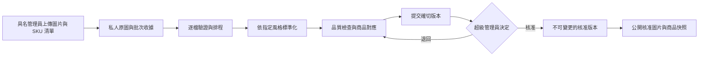
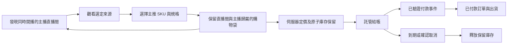

# iSunTVMall 後台建置計畫

2026 年 9 月 25 日 · 待實作方案 · [英文版](BACKEND-PLAN.md)

## 產品方向

保留目前的 **muji** 商店風格。以單一商戶的交易系統服務多個獨立主播直播間：每位主播使用已獲授權的來源開播，各直播間有自己的核准商品組合，並共用庫存與結帳系統。顧客切換直播間時保留購物袋。首版先採用可支援的 YouTube 播放器及清楚的原平台連結；其他嵌入式播放器須完成帳號條件與實際播放驗證後才啟用。

「同步直播」在此指顯示獲授權的平台播放器，不代表擷取、代理或轉播其他平台的影像。Instagram 直播能否在本網站內播放仍為 **UNKNOWN**，因此首版開啟 Instagram，同時保留本網站的購物袋。日後可研究由主播直接提供、取得授權的原始串流，另建支援的播放器；這不等於從 Instagram 擷取影片。

本文區分已實作的批次基礎與更廣泛的正式後台方案。目前原始碼已有個人帳號驗證、兩種角色檢查、私人儲存遷移、租約佇列及綁定版本審批。線上配置仍為 UNKNOWN/HOLD，不代表已啟用團隊帳號、遠端遷移、儲存、工作程序、真實主播頻道或付款服務。

## 已有證據與待完成工作

| 範圍 | 本次檢查的證據 | 下一步 |
|---|---|---|
| SHOPLINE 參考 | 9 月 23 日審查觀察到商品／規格表單、批次操作、設計控制、各來源直播設定、訂單篩選、結帳設定與聯盟分潤選項。 | 借鑑工作流程，建立我們自己的系統。 |
| SHOPLINE 驗證限制 | 測試商店沒有商品；匯入與付款選擇器停用。未完成直播、訂單、付款或分潤活動；未連接 Instagram 專業帳號。 | 批次儲存、多主播同時運作、合作方權限、付款全流程及獨立嵌入仍為 **UNKNOWN**。看見選單不等於功能已驗證。 |
| 現有前台 | 原始碼包含 96 件示範商品、17 個節慶系列、語言切換、直播間與保留來源歸屬的購物袋。 | 只有取得核准、商業資料經驗證的商品才可取代示範商品。 |
| 現有後台 | 舊商品／CSV、主播、直播間與訂單畫面使用共用密碼。新批次服務另行驗證具名 Supabase 使用者，每次操作讀取有效的 `catalog_editor`／`super_admin` 身分，編輯者只可操作自己的批次。 | 配置並測試帳號、儲存與工作程序。多重驗證、其他角色、商店／主播範圍及取代舊直播／訂單登入仍屬計畫。舊共用密碼不授予批次核准權。 |
| 現有圖片路徑 | 新程式包含私人原圖／結果儲存、具名角色、短效預覽、有限圖片處理、租約工作、綁定版本超級管理員審批及新商品交易式刊登。`BATCH_HELPER_ENABLED=true` 時，舊上傳／商品／匯入介面回傳 403。 | 遠端遷移、儲存隱私、團隊配置及工作程序基本測試通過前，維持停用。正式配置仍為 UNKNOWN，存在程式不代表服務已運行。 |
| 現有直播模型 | 已有主播、直播場次及場次商品關聯；轉接器產生 YouTube／Facebook 播放器及 Instagram 連結。場次和商品關聯分開寫入。 | 以交易更新直播間、記錄來源驗證狀態、商品置頂事件、主播權限及實際平台播放測試。產生播放器網址不代表能成功播放。 |
| 現有結帳原始碼 | Stripe 託管結帳與 SQL 包含庫存保留、伺服器定價、商品行歸屬、事件去重、到期及付款覆核狀態。 | 在獲授權的資料庫與付款環境執行遷移及完整測試。目前 `checkoutReleaseReady()` 回傳 `false`，正式結帳繼續關閉。 |
| 現有庫存規模 | 庫存保留 SQL 使用共用交易鎖與商品庫存；目前一個商品代表一個 SKU。 | 試營運前驗證最後一件商品的並行競爭。加入商品到 SKU 規格關聯，不重寫無關功能；先量測鎖競爭再決定擴充方式。 |

檢查範圍：`src/lib/admin-auth.ts`、`src/lib/admin/catalog.ts`、`src/lib/live/adapters.ts`、`src/lib/cart.ts`、`src/lib/stripe/checkout.ts`、`src/app/api/admin/upload/route.ts`、`src/types/commerce.ts`、`supabase/migrations/`。SHOPLINE 歷史證據保留於獨立審查文件；其中部署前的網域及登入狀態不是目前部署狀態。

## 建議的人員角色

採用個人帳號與具體權限，不建立層層擴權的管理員階級。

| 職能 | 適當責任 | 權限邊界 |
|---|---|---|
| 擁有人／超級管理員 | 團隊存取、商店設定、商品與圖片最終核准、付款設定、退款及緊急下架 | 人數維持精簡；敏感操作需多重驗證及近期重新登入。 |
| 營運主管 | 日常商品協調、排程、異常處理及已核准活動 | 不可授予角色，不可自行核准自己上傳的商品。 |
| 商品編輯 | 文案、規格、價格、草稿匯入及送審 | 不可上架或修改付款設定。 |
| 圖片操作員 | 上傳、選擇風格、檢查圖片及處理錯誤 | 不可核准圖片或改動商業資料。 |
| 直播製作人 | 準備直播間、配置核准商品、驗證來源、商品置頂及結束場次 | 不可取得付款憑證或不限範圍的顧客資料。 |
| 主播／創作者 | 自己的介紹草稿、指定直播間、核准商品選擇及自己的彙總成效 | 不可存取其他主播直播間、內部成本或顧客聯絡資料。 |
| 客服 | 指派訂單、顧客查詢及退款申請 | 不可執行退款或匯出顧客資料庫。 |
| 出貨人員 | 已付款訂單的包裝、物流標籤與追蹤 | 只可讀取所需收件資料，不可修改付款設定。 |
| 財務 | 對帳、退款覆核及日後的分潤報表 | 執行退款須明確授權；首版不自動支付主播分潤。 |
| 分析人員 | 商品、直播間及銷售彙總報告 | 唯讀，預設不提供顧客身分。 |

### 建議下一階段採六組交易後台權限

已實作的批次基礎目前只有「超級管理員」及「商品編輯」兩種角色。下列六組屬下一階段交易後台方案，尚未全部實作。團隊精簡時合併職能：圖片人員用商品編輯、製作人用營運、客服與出貨用訂單操作員但另限任務範圍。初期由擁有人處理財務，待人力需求出現再拆分。

| 權限 | 超級管理員 | 營運 | 商品編輯 | 主播 | 訂單操作員 | 分析人員 |
|---|---|---|---|---|---|---|
| 邀請／撤銷帳號及設定 | 可 | 不可 | 不可 | 不可 | 不可 | 不可 |
| 上傳／處理／編輯草稿 | 可 | 可 | 可 | 僅自己的送審內容 | 不可 | 不可 |
| 核准與上架商品 | 可 | 不可 | 不可 | 不可 | 不可 | 不可 |
| 準備直播間及核准商品欄 | 可 | 全店 | 不可 | 自己的直播間 | 不可 | 不可 |
| 公開直播間／變更來源 | 可 | 全店 | 不可 | 只能申請 | 不可 | 不可 |
| 在已公開直播間置頂商品 | 可 | 全店 | 不可 | 自己的核准商品欄 | 不可 | 不可 |
| 讀取顧客／訂單資料 | 可 | 遮蔽敏感資料的異常項目 | 不可 | 不可 | 指派任務範圍 | 不可 |
| 出貨／追蹤 | 可 | 不可 | 不可 | 不可 | 出貨任務範圍 | 不可 |
| 執行退款／付款設定 | 可 | 不可 | 不可 | 不可 | 只能申請 | 不可 |
| 彙總報告 | 全店 | 全店 | 僅商品 | 自己的主播資料 | 指派工作佇列 | 全店 |

完整後台的目標：每個介面與伺服器操作驗證工作階段後，呼叫 `authorize(actor, action, resource)`；預設拒絕。查詢、寫入、匯出及簽署圖片下載均須限制 `store_id`、指定 `kol_id` 與任務範圍。不可相信瀏覽器提交的角色、主播識別碼或核准旗標。撤銷帳號須令現有工作階段失效；高權限登入需多重驗證。紀錄操作者、動作、目標、版本及結果，不記錄憑證或完整顧客資料。隱藏按鈕只是介面便利，不是授權機制。

## 後台導覽與工作畫面

沿用前台節制的留白、色彩與語言切換，清楚呈現當前任務與下一個動作。

1. **總覽：**預定／進行中的直播、待處理訂單、處理失敗及審批佇列，只顯示真實數字。
2. **商品：**商品、規格、庫存、系列、批次上傳及版本；清楚區分草稿、待審、已核准與已上架。
3. **圖片工作室：**原圖與結果比較、風格選擇（預設 muji）、檔案與 SKU 對應及品質問題。
4. **審批：**超級管理員審閱確切商品及圖片版本，核准選定列或附原因退回。失敗批次不可被隱含全數核准。
5. **直播工作室：**日曆與直播間清單；每間包含來源預覽、主播、商品欄、置頂商品與連線狀態。多個直播間獨立運作。
6. **訂單：**分開顯示付款、訂單及出貨狀態；支援搜尋、指派佇列、物流及退款申請。
7. **人員與報表：**主播介紹與自身成效；團隊權限僅擁有人可管；財務與彙總報告依權限提供。
8. **設定：**運送／退款／聯絡政策、付款準備度、來源連線及稽核歷史；瀏覽器回應不包含機密。

## 商品批次助手：正式服務契約

儲存庫中的 `batch_helper` 現已有固定規則圖片引擎、個人帳號介面、審閱畫面及 SQL 佇列基礎。**已實作首版範圍：一張選定圖片成為一件新商品草稿，每批最多一千筆。** 不覆寫既有貨號。檔名對應貨號的 CSV 提供明確商業資料，或由編輯者在審閱前補齊所有欄位；只有檔名不能證明可售資料。多圖商品、規格及既有商品版本更新延後。線上配置仍為 UNKNOWN/HOLD 時，公開工作區清楚標示為預覽。下列流程已有原始碼，實際完成仍須配置及基本測試：

- **收件：**首版將完整檔案直接上傳私人儲存，重新選取原圖後跳過已完成上傳以續作批次；大型檔案的 TUS／分塊續傳延後。保留原始檔名、上傳者、明確 SKU 資料及處理程序計算的雜湊。驗證檔案簽章、解碼尺寸／像素上限及格式。明確的一圖一草稿規則最多建立一千筆待審草稿，絕不自動核准商品；缺少描述／價格會阻擋核准。通用多圖分組是後續目標。
- **轉換：**依方向資訊旋轉、不裁掉商品本體的縮放、套用風格背景與畫布、輸出網頁尺寸及移除非必要中繼資料，並保留原圖。風格只能改變展示方式，不得改動商品真實顏色、形狀、標籤、數量或材料。生成式修圖是可選、需覆核並保留來源紀錄的操作，不可成為看不見的預設。
- **規模：**已實作有限工作程序、依雜湊保存不覆寫結果、版本檢查及十分鐘租約。中斷工作可重新領取，最多三次；失敗／退回項目需明確恢復操作。建立批次使用穩定請求識別碼及相同內容檢查。通用自動退避重試及正式工作排程仍待實作。續作時不重做已驗證成功項目；量測數量、位元組及時間，不猜測處理量。
- **審批：**目前核准綁定有效的具名超級管理員與確切項目版本；伺服器保存其商品資料及原圖／輸出雜湊，修改草稿會清除核准。刊登前再次檢查審批者有效性及輸出內容。標準化整體清單雜湊可作為後續稽核加強。首版不可編輯已刊登商品；未來版本管理須讓舊核准快照在新草稿審閱期間繼續公開。日常庫存另走具稽核紀錄的交易。
- **公開：**工作程序把核准衍生圖複製至公開位置並驗證內容，再由 SQL 交易重查核准／版本並新增商品與圖片，拒絕既有貨號。失敗或撤銷的刊登可能留下未列入商品的已核准圖片副本；原圖維持私人，清理另行處理。啟用批次模式時關閉舊商品寫入。既有商品回復及版本刊登仍待建置；上傳資料不得放入 GitHub。
- **驗收：**一千檔測試批次必須承受上傳中斷、工作程序重啟及重複投遞；每個檔案均有唯一最終結果，每個預期 SKU 對應都有交代。一般管理員上架應被拒絕；圖片變更令舊核准失效；單張損壞圖片不可抹去其他結果。執行環境未量測前，處理量與成本維持 **UNKNOWN**；基準測試後再設定服務目標。

## 直播來源能力政策

| 平台 | 首版行為 | 目前證據／待通過條件 |
|---|---|---|
| YouTube | 使用獲授權且允許嵌入的影片識別碼載入官方播放器，提供來源連結備援 | 9 月 25 日已查核官方播放器文件；真實主播內容、開播資格、嵌入允許及網域／瀏覽器播放仍需實際帳號測試。 |
| Facebook | 有條件使用官方嵌入播放器，提供來源連結備援 | 已有轉接程式；本次官方 Meta 文件回傳 HTTP 429，現行帳號／直播限制及成功播放仍為 **UNKNOWN**，測試前不可宣稱已驗證。 |
| Instagram | 在新分頁／應用程式開啟官方直播，保留本網站直播間與購物袋 | 未驗證到官方現行直播嵌入支援。公開貼文／短片可嵌入不代表直播可播放。不可擷取影片網址，也不能將帳號連接當成播放證據。 |
| 其他來源 | 預設外部連結；完成有範圍的測試才加入專用轉接器 | 錄播嵌入不代表支援直播；擁有人直接提供的串流需另定接收與播放方案。 |

YouTube 商品資訊放在播放器旁或下方，不遮蓋控制項；提供所需來源識別、保留品牌、播放器至少 200 × 200，單頁最多一個自動播放的 YouTube 播放器。參閱[官方播放器要求](https://developers.google.com/youtube/terms/required-minimum-functionality)。私人／不存在影片、禁止嵌入及身分識別錯誤必須清楚處理，參閱 [IFrame 介面文件](https://developers.google.com/youtube/iframe_api_reference)。平台及網路緩衝會造成延遲，不承諾零延遲或逐幀同步商品置頂。

每個來源建立驗證紀錄：平台、來源識別碼、擁有人授權、嵌入結果、測試網域／裝置、時間及備援原因。製作人確認所選來源後才公開直播間。首版先手動提供影片識別碼；自動發現、平台授權連線、直播聊天及留言下單是日後獨立整合。本次嘗試查閱的 Meta 官方來源為 [Facebook 嵌入影片](https://developers.facebook.com/docs/plugins/embedded-video-player/)及 [Instagram oEmbed](https://developers.facebook.com/docs/instagram-platform/oembed/)，未成功取得其現行內容。

## 顧客流程與交易規則

在直播間內開啟商品或購物袋時保留播放器；切換直播間只換播放來源，購物袋不變。完成付款後回到訂單與原直播間；手機瀏覽器／平台行為可能中斷播放，因此提供清楚的繼續觀看操作。

價格使用整數最小貨幣單位，一筆訂單只使用一種貨幣。訂單明細保留不可變更的名稱、SKU、價格、稅／運費與經驗證的主播／直播間歸屬。兩間直播間競售最後一件商品時，共用一個原子庫存保留。重複結帳與付款通知不可重建訂單或重複扣庫存。顧客到達取消頁，不代表可以立即釋放庫存，須與付款平台狀態核對。遲到付款、金額不符、爭議及退款事件交人工覆核；只有已驗證付款訂單可出貨。退款與退貨回補庫存分開決定。首版是單一商戶、集中出貨；日後分潤以完成結算銷售扣除退款計算，保留核准規則快照，不自動支付。

## 資料模型與服務邊界

沿用現有應用程式及關聯式交易，補上缺少實體，不為每個畫面另建微服務。

| 實體組 | 核心關聯／規則 |
|---|---|
| Store、User、Membership、PermissionGrant | 具名使用者屬於商店；授權包含操作與資源範圍；撤銷工作階段後不可繼續操作。 |
| KOL、Channel、LiveSession、StreamSource | 主播擁有頻道與直播間；來源能力／授權獨立於直播間狀態。 |
| Product、SKU、ProductRevision | 商品保存多語內容；SKU 保存可售規格及庫存鍵；上架指向不可變更的核准版本。 |
| MediaBatch、MediaAsset、TransformJob、StyleVersion | 圖片屬於批次／SKU；記錄私人原圖與衍生圖雜湊；工作可續作且重試不重複產生副作用。 |
| Approval、Publication、AuditEvent | 核准綁定操作者、版本及雜湊；公開紀錄指向核准；每次修改可追溯。 |
| LiveProduct、PinEvent | 每間直播間的核准 SKU 與排序；事件版本遞增，拒絕過時置頂指令。 |
| Cart、CartLine | SKU／數量及直播間／主播背景；伺服器驗證關聯；顧客端價格沒有權威。 |
| InventoryReservation、Order、OrderItem | 共用 SKU 庫存、到期保留、不可變更訂單快照及明確生命週期。 |
| PaymentEvent、Fulfillment、RefundRequest | 平台事件識別碼唯一；財務與物流狀態分離；個人資料受限。 |
| CommissionEntry（日後） | 商品行受益者及規則快照；保留沖銷／退款紀錄，不覆寫歷史。 |

建議執行架構：現有 Cloudflare 前台／介面、現有關聯式資料庫轉接器保存交易、私人物件儲存保存原圖、只公開核准衍生圖、持久工作佇列搭配圖片處理程序。首版商品置頂使用版本號與一般輪詢；實際體驗需要時才加入推送。平台憑證保存在執行環境機密儲存；圖片處理不佔用網頁請求時限。本文不代表已確認資料庫與佇列的可用性、成本或正式憑證。

## 至 9 月 30 日的交付安排

以下是目標與上線條件，不是已完成事項。目標在 9 月 29 日受控試營運，9 月 30 日保留給修正；外部帳號核准無法由軟體排程保證。

| 目標日期 | 交付 | 可量測完成條件 |
|---|---|---|
| 9 月 25–26 日 | 保存六種風格，muji 預設；完成並驗證已實作的兩角色批次基礎 | 可選風格、原圖保留、可重現處理版本審閱，一般上傳者不可公開商品。 |
| 9 月 26–27 日 | 配置批次個人身分、儲存／佇列與工作程序，擴充權限覆蓋 | 跨角色／跨主播拒絕測試通過；撤銷登入失效；改版後不可沿用舊核准；可回復已核准版本。 |
| 9 月 27–28 日 | 直播工作室與直播間／商品操作 | 兩名獲授權主播同時運作且商品欄獨立；切換後保留購物袋；來源失效仍可購物；每個啟用平台均有播放證據。 |
| 9 月 28–29 日 | 付款／資料庫測試環境與訂單操作 | 最後一件競爭最多一筆保留；重複通知只產生一筆已付款訂單；到期、不確定結帳、金額不符及退款覆核測試通過；運費與政策獲核准。 |
| 9 月 29 日 | 全部條件通過後受控正式試營運 | 真實商品已核准、來源授權已取得、商戶付款已設定、有限範圍購買／退款完整成功、出貨演練、手機檢查及回復收據。 |
| 9 月 30 日 | 穩定運作並決定下一階段 | 修正試營運缺陷，指定營運負責人、提供手冊及實測佇列結果。缺少條件時維持預覽／停用付款，記錄確切阻礙。 |

**目前仍為 UNKNOWN 的依賴：**個人登入／多重驗證配置、正式資料庫遷移狀態、私人圖片儲存／佇列及基準測試、真實商品權利／規格／過敏原／庫存、主播授權及播放、付款商戶開通與完整測試、物流／稅務／退款／聯絡規則、出貨負責人及服務目標。軟體可繼續使用受控測試資料開發；真實銷售及未驗證平台各自維持上線門檻。

**延後項目：**通用社群聊天、留言下單、自建轉碼或轉播、多商戶結算、自動主播分潤、顧客客製上傳及複雜促銷引擎。第一個有用的後台是「核准商品 → 已驗證直播間 → 可靠訂單」，每個步驟都有可追溯的負責人。

## 發佈驗證 — 9 月 25 日

商品資料改為明確分頁讀取，店舖每頁顯示 48 件商品，商戶可填寫獨立中英文文案。批量選取綁定商品編號及已審阅版本。處理程序的網絡請求設有串流容量上限及逾時限制；現有儲存桶私隱、容量或格式設定不相容時，遷移會停止。已通過 93 項應用測試、35 項預留庫存檢查、14 項圖片與網絡程序檢查、31 項批次流程及 10 項儲存設定檢查。1,000 張合成圖片的本機處理為 33.761 秒，並非網絡上傳或正式環境吞吐量。遠端帳戶、儲存及處理程序仍未核實；啟用前須設定總上傳配額及試行儲存預算。登出清除此瀏覽器的登入憑證，不代表全域撤銷所有權杖。
