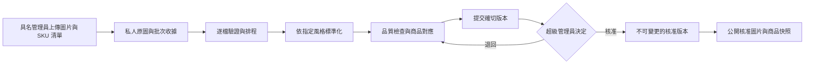
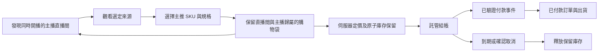

# iSunTVMall 後台建置計畫

2026 年 9 月 25 日 · 實作狀態與待完成上線計畫 · [英文版](BACKEND-PLAN.md)

## 產品方向

保留目前的 **muji** 商店風格。以單一商戶的交易系統服務多個獨立主播直播間：每位主播使用已獲授權的來源開播，各直播間有自己的核准商品組合，並共用庫存與結帳系統。顧客切換直播間時保留購物袋。首版先採用可支援的 YouTube 播放器及清楚的原平台連結；其他嵌入式播放器須完成帳號條件與實際播放驗證後才啟用。

「同步直播」在此指顯示獲授權的平台播放器，不代表擷取、代理或轉播其他平台的影像。Instagram 直播能否在本網站內播放仍為 **UNKNOWN**，因此首版開啟 Instagram，同時保留本網站的購物袋。日後可研究由主播直接提供、取得授權的原始串流，另建支援的播放器；這不等於從 Instagram 擷取影片。

原始碼現已包含六種具名員工角色、高權限角色多重驗證、即時工作階段／成員撤銷檢查、邀請及密碼設定流程、私人直播版本、經驗證公開與商品置頂、範圍受限的訂單操作、報表及持久批次容量管理。這些是已實作基礎，不代表商戶服務已啟用。正式身分系統、資料庫遷移、儲存、工作程序安裝、平台播放及付款證據仍為 **UNKNOWN/HOLD**，真實結帳維持關閉。

## 已有證據與待完成工作

| 範圍 | 本次檢查的證據 | 下一步 |
|---|---|---|
| SHOPLINE 參考 | 9 月 23 日審查觀察到商品／規格表單、批次操作、設計控制、各來源直播設定、訂單篩選、結帳設定與聯盟分潤選項。 | 借鑑工作流程，建立我們自己的系統。 |
| SHOPLINE 驗證限制 | 測試商店沒有商品；匯入與付款選擇器停用。未完成直播、訂單、付款或分潤活動；未連接 Instagram 專業帳號。 | 批次儲存、多主播同時運作、合作方權限、付款全流程及獨立嵌入仍為 **UNKNOWN**。看見選單不等於功能已驗證。 |
| 現有前台 | 原始碼包含 96 件示範商品、17 個節慶系列、語言切換、直播間與保留來源歸屬的購物袋。 | 只有取得核准、商業資料經驗證的商品才可取代示範商品。 |
| 現有後台 | 具名 Supabase 登入支援六種角色；超級管理員、營運與訂單操作員須通過 `aal2` 多重驗證。每次請求檢查身分、工作階段存續／撤銷及有效成員資格。團隊介面支援角色／主播綁定及邀請；受邀者設定密碼後須重新登入。 | 安全配置真實團隊與首位擁有人，在實際專案驗證多重驗證、邀請寄送／轉址及撤銷。此實作沒有以實際寄出邀請作為證明；舊共用密碼權杖不能授權新後台。 |
| 現有圖片路徑 | 已有私人原圖／結果儲存、限定範圍的預覽、圖片標準化、租約工作、綁定版本的超級管理員審批及交易式新商品刊登。舊商品／匯入／上傳介面一律回傳 410；容量收件預留原圖及衍生圖預算。 | 套用並驗證遠端遷移／政策，盤點保留物件、配置人員與核准預算、安裝單一排程工作程序並測試儲存／審批／刊登。`BATCH_HELPER_ENABLED` 仍是獨立啟用門檻。 |
| 現有直播操作 | 已有獨立私人草稿版本、主播自己的編輯／申請範圍、營運／超級管理員來源檢查、原子直播間／商品欄公開、商品置頂及每五秒公開輪詢。前台查詢要求 `is_public` 及有效主播。 | 在正式網域驗證真實獲授權直播。必須記錄綁定版本的製作人檢查，但這不等於平台自動認證。 |
| 現有訂單與報表 | 已有分頁及角色範圍讀取、分開的客服／出貨任務、已付款訂單包裝／寄出／送達、退款申請及超級管理員覆核、版本／重試去重及稽核。分析人員／主播只取得彙總或自己的成效，不取得顧客紀錄。 | 使用真實付款平台測試事件及出貨人員演練。核准退款不會轉移資金、改變付款狀態或回補庫存；實際財務退款仍獨立處理。 |
| 現有設定 | 僅超級管理員可讀的準備狀態頁，顯示設定是否存在及未驗證條件，不揭露憑證，也不寫入設定。 | 開放結帳前核准實際運費／地區、稅務處理、退款／聯絡政策及營運負責人。存在設定不代表連線測試通過。 |
| 現有結帳原始碼 | Stripe 託管結帳與 SQL 包含庫存保留、伺服器定價、商品行歸屬、事件去重、到期及付款覆核狀態。 | 在獲授權的資料庫與付款環境執行遷移及完整測試。目前 `checkoutReleaseReady()` 回傳 `false`，正式結帳繼續關閉。 |
| 現有庫存規模 | 庫存保留 SQL 使用共用交易鎖與商品庫存；目前一個商品代表一個 SKU。 | 試營運前驗證最後一件商品的並行競爭。加入商品到 SKU 規格關聯，不重寫無關功能；先量測鎖競爭再決定擴充方式。 |

檢查範圍：`src/lib/staff/`、`src/lib/live/operations.ts`、`src/lib/live/operations-schema.ts`、`src/lib/orders/`、`src/app/api/admin/`、`src/app/admin/(protected)/settings/page.tsx`、`batch_helper/`、`supabase/migrations/` 及既有結帳程式。SHOPLINE 歷史證據保留於獨立審查文件，其中舊部署／登入觀察不代表目前原始碼或部署狀態。

## 建議的人員角色

採用個人帳號與具體權限，不建立層層擴權的管理員階級。下列職能是建議組織，後面的權限表才是範圍較小的已實作基礎；職稱不代表商品規格、實際退款、物流標籤購買或政策編輯已完成。

| 職能 | 適當責任 | 權限邊界 |
|---|---|---|
| 擁有人／超級管理員 | 團隊存取、商店設定、商品與圖片最終核准、付款設定、退款及緊急下架 | 人數維持精簡；敏感操作需多重驗證及近期重新登入。 |
| 營運主管 | 日常商品協調、排程、異常處理及已核准活動 | 不可授予角色，不可自行核准自己上傳的商品。 |
| 商品編輯 | 文案、規格、價格、草稿匯入及送審 | 不可上架或修改付款設定。 |
| 圖片操作員 | 上傳、選擇風格、檢查圖片及處理錯誤 | 不可核准圖片或改動商業資料。 |
| 直播製作人 | 準備直播間、配置核准商品、驗證來源、商品置頂及結束場次 | 不可取得付款憑證或不限範圍的顧客資料。 |
| 主播／創作者 | 自己的介紹草稿、指定直播間、核准商品選擇及自己的彙總成效 | 不可存取其他主播直播間、內部成本或顧客聯絡資料。 |
| 客服 | 指派訂單、顧客查詢及退款申請 | 不可執行退款或匯出顧客資料庫。 |
| 出貨人員 | 已付款訂單的包裝、物流標籤與追蹤 | 只可讀取所需收件資料，不可修改付款設定。 |
| 財務 | 對帳、退款覆核及日後的分潤報表 | 執行退款須明確授權；首版不自動支付主播分潤。 |
| 分析人員 | 商品、直播間及銷售彙總報告 | 唯讀，預設不提供顧客身分。 |

### 已實作的六組預設權限

授權程式及資料結構現已有六種角色：`super_admin`、`operator`、`catalog_editor`、`kol`、`order_operator`、`analyst`。圖片人員使用商品編輯、製作人使用營運；客服與出貨共用訂單操作員，但按訂單分別指派任務。初期由擁有人處理財務覆核。真實帳號仍須配置，專門職能可日後再拆分。

| 權限 | 超級管理員 | 營運 | 商品編輯 | 主播 | 訂單操作員 | 分析人員 |
|---|---|---|---|---|---|---|
| 邀請、變更成員及撤銷存取 | 可 | 不可 | 不可 | 不可 | 不可 | 不可 |
| 查看商店準備狀態（不可編輯設定） | 可 | 不可 | 不可 | 不可 | 不可 | 不可 |
| 上傳／處理／編輯商品草稿 | 全部批次 | 自己的批次 | 自己的批次 | 自己的批次 | 不可 | 不可 |
| 核准與上架商品 | 可 | 不可 | 不可 | 不可 | 不可 | 不可 |
| 準備直播間及核准商品欄 | 可 | 全店 | 不可 | 自己的直播間 | 不可 | 不可 |
| 公開直播間／變更來源 | 可 | 全店 | 不可 | 只能申請 | 不可 | 不可 |
| 在已公開直播間置頂商品 | 可 | 全店 | 不可 | 自己的核准商品欄 | 不可 | 不可 |
| 讀取顧客／訂單資料 | 可 | 遮蔽敏感資料的異常項目 | 不可 | 不可 | 指派任務範圍 | 不可 |
| 出貨／追蹤 | 可 | 不可 | 不可 | 不可 | 出貨任務範圍 | 不可 |
| 覆核退款申請 | 可 | 不可 | 不可 | 不可 | 客服範圍可申請 | 不可 |
| 執行財務退款／編輯付款設定 | 尚未實作 | 不可 | 不可 | 不可 | 不可 | 不可 |
| 彙總報告 | 全店 | 全店 | 商品及自己批次數量 | 自己的主播資料 | 指派工作佇列 | 全店 |

已實作介面會驗證具名員工並呼叫預設拒絕的權限檢查；SQL 操作再獨立核對有效角色及主播／訂單範圍。顧客端傳入的角色或核准旗標沒有權威。目前是單一商戶／商店，依主播、批次擁有人與訂單指派隔離；多商店 `store_id` 租戶模型留待後續通用化。

超級管理員、營運及訂單操作員須多重驗證。登出先把目前工作階段識別碼寫入伺服器撤銷表，才清除瀏覽器憑證；後續請求會再核對成員／工作階段。這是撤銷目前工作階段，不代表讓所有裝置全域登出。單憑邀請寄達不授予權限，必須有有效成員資格及完成登入；未完成／失敗成員狀態會被紀錄。稽核不回傳機密或完整顧客資料。既有簽署圖片網址在短效期限屆滿前仍可能可用，即使成員已撤銷；新網址請求會立即拒絕。

## 後台導覽與工作畫面

沿用前台節制的留白、色彩與語言切換，清楚呈現當前任務與下一個動作。

1. **總覽／分析：**已實作商品／直播間／批次数量、遮蔽敏感資料的異常、分幣別已付款彙總及自己的主播歸屬，不捏造收入、觀看人數或付款事件。
2. **商品／圖片工作室：**已實作檢視與批次流程、原圖／結果比較、六種風格（預設 muji）、明確檔案與貨號資料及雙語商品文案。多圖規格與既有商品版本編輯延後。
3. **審批：**已實作超級管理員逐項或有限批次核准、綁定已審版本、退回備註及拒絕過時版本。
4. **直播工作室：**已實作私人草稿、核准商品排序、來源預覽／檢查、公開申請、營運公開與目前商品置頂。視覺日曆及自動尋找頻道延後。
5. **訂單：**已實作範圍受限的搜尋／佇列、分離付款與出貨狀態、包裝／物流／送達及退款申請／覆核，沒有自動購買物流或執行財務退款。
6. **團隊與主播：**已實作超級管理員成員／邀請流程、角色／主播綁定與主播管理；主播自行編輯介紹留待後續。
7. **設定：**已實作擁有人唯讀準備狀態。實際政策、物流設定及付款憑證管理仍在此介面之外，商業啟用資料尚待確立。

## 商品批次助手：正式服務契約

儲存庫中的 `batch_helper` 現已有固定規則圖片引擎、個人帳號介面、審閱畫面及 SQL 佇列基礎。**已實作首版範圍：一張選定圖片成為一件新商品草稿，每批最多一千筆。** 不覆寫既有貨號。檔名對應貨號的 CSV 提供明確商業資料，或由編輯者在審閱前補齊所有欄位；只有檔名不能證明可售資料。多圖商品、規格及既有商品版本更新延後。線上配置仍為 UNKNOWN/HOLD 時，公開工作區清楚標示為預覽。下列流程已有原始碼，實際完成仍須配置及基本測試：

- **收件：**首版將完整檔案直接上傳私人儲存，重新選取原圖後跳過已完成上傳以續作批次；大型檔案的 TUS／分塊續傳延後。保留原始檔名、上傳者、明確 SKU 資料及處理程序計算的雜湊。驗證檔案簽章、解碼尺寸／像素上限及格式。明確的一圖一草稿規則最多建立一千筆待審草稿，絕不自動核准商品；缺少英文／繁體中文名稱、說明或價格會阻擋核准。通用多圖分組是後續目標。
- **轉換：**依方向資訊旋轉、不裁掉商品本體的縮放、套用風格背景與畫布、輸出 1,600 像素 WebP 及移除非必要中繼資料，並保留原圖。風格只能改變展示方式，不得改動商品真實顏色、形狀、標籤、數量或材料。首版不提供生成式修圖或去背，日後加入時須有明確來源紀錄及覆核。
- **規模與容量：**持久工作使用不可覆寫結果、版本保護、十分鐘租約，最多領取三次後需人工恢復。建立批次綁定穩定請求識別碼與確切內容。預設收件限制：每批一千項／宣告輸入 512 MiB；每人一千項／全店三千項未完成工作；每人保留預算 32 GiB／全店 50 GiB。每個原圖欄位先預留完整 24 MiB 上傳上限，衍生圖／公開副本另依確切容量預留。刊登會釋放佇列額度，絕不釋放保留儲存額度。這是保守操作上限，不是已購容量或實測磁碟用量；超級管理員調整有稽核，沒有自動刪除／釋放配額。
- **工作程序：**已實作網路容量與時間限制、有界執行、單一程序鎖、中斷恢復、有界健康快照與部署範本／手冊；檔案本身不安裝排程。先盤點既有物件與核准預算、完成有限測試批次，再啟用單一具名 Studio 工作程序。完整遠端吞吐量及真正多連線資料庫競爭仍須驗證。
- **審批：**目前核准綁定有效的具名超級管理員與確切項目版本；伺服器保存其商品資料及原圖／輸出雜湊，修改草稿會清除核准。刊登前再次檢查審批者有效性及輸出內容。標準化整體清單雜湊可作為後續稽核加強。首版不可編輯已刊登商品；未來版本管理須讓舊核准快照在新草稿審閱期間繼續公開。日常庫存另走具稽核紀錄的交易。
- **公開：**工作程序把核准衍生圖複製至公開位置並驗證內容，再由 SQL 交易重查核准／版本並新增商品與圖片，拒絕既有貨號。失敗或撤銷的刊登可能留下未列入商品的已核准圖片副本；原圖維持私人，清理另行處理。舊商品直接寫入現一律回傳 HTTP 410，與批次旗標無關。既有商品回復及版本刊登仍待建置；上傳資料不得放入 GitHub。
- **驗收：**一千檔測試批次必須承受上傳中斷、工作程序重啟及重複投遞；每個檔案均有唯一最終結果，每個預期 SKU 對應都有交代。一般管理員上架應被拒絕；圖片變更令舊核准失效；單張損壞圖片不可抹去其他結果。執行環境未量測前，處理量與成本維持 **UNKNOWN**；基準測試後再設定服務目標。

## 直播來源能力政策

| 平台 | 首版行為 | 目前證據／待通過條件 |
|---|---|---|
| YouTube | 使用獲授權且允許嵌入的影片識別碼載入官方播放器，提供來源連結備援 | 9 月 25 日已查核官方播放器文件；真實主播內容、開播資格、嵌入允許及網域／瀏覽器播放仍需實際帳號測試。 |
| Facebook | 有條件使用官方嵌入播放器，提供來源連結備援 | 已有轉接程式；本次官方 Meta 文件回傳 HTTP 429，現行帳號／直播限制及成功播放仍為 **UNKNOWN**，測試前不可宣稱已驗證。 |
| Instagram | 在新分頁／應用程式開啟官方直播，保留本網站直播間與購物袋 | 未驗證到官方現行直播嵌入支援。公開貼文／短片可嵌入不代表直播可播放。不可擷取影片網址，也不能將帳號連接當成播放證據。 |
| 其他來源 | 預設外部連結；完成有範圍的測試才加入專用轉接器 | 錄播嵌入不代表支援直播；擁有人直接提供的串流需另定接收與播放方案。 |

YouTube 商品資訊放在播放器旁或下方，不遮蓋控制項；提供所需來源識別、保留品牌、播放器至少 200 × 200，單頁最多一個自動播放的 YouTube 播放器。參閱[官方播放器要求](https://developers.google.com/youtube/terms/required-minimum-functionality)。私人／不存在影片、禁止嵌入及身分識別錯誤必須清楚處理，參閱 [IFrame 介面文件](https://developers.google.com/youtube/iframe_api_reference)。平台及網路緩衝會造成延遲，不承諾零延遲或逐幀同步商品置頂。

已實作來源檢查將平台／網址／識別碼、觀看方式、權利／播放確認、測試網域、裝置備註、檢查人及時間綁定草稿版本。公開前須有有效營運／超級管理員在 24 小時內的檢查、已公開且非示範的商品及有效主播。每次儲存修改均需新檢查。主播只可準備／申請自己的直播間，以及置頂自己已公開商品欄；修改已儲存來源與公開需要營運／超級管理員。草稿不洩漏給觀眾，直播間及商品欄一併提交。輪詢不包含檢查、員工身分或草稿，過時版本不可撤銷更新的置頂。

自動尋找來源、平台授權連線、聊天及留言下單仍屬後續整合。本次嘗試的 Meta 官方參考為 [Facebook 嵌入影片](https://developers.facebook.com/docs/plugins/embedded-video-player/)及 [Instagram oEmbed](https://developers.facebook.com/docs/instagram-platform/oembed/)，未成功取得其現行內容。

## 顧客流程與交易規則

目前直播輪詢只更新商品精選，不重新掛載播放器；切換直播間保留購物袋，來源變更時提供明確重新載入操作。圖中付款旅程仍是目標，正式環境尚未開放；付款後返回原直播間與手機繼續播放行為，必須在付款啟用階段驗證。

價格使用整數最小貨幣單位，一筆訂單只使用一種貨幣。訂單明細保留不可變更的名稱、SKU、價格、稅／運費與經驗證的主播／直播間歸屬。兩間直播間競售最後一件商品時，共用一個原子庫存保留。重複結帳與付款通知不可重建訂單或重複扣庫存。顧客到達取消頁，不代表可以立即釋放庫存，須與付款平台狀態核對。遲到付款、金額不符、爭議及退款事件交人工覆核；只有已驗證付款訂單可出貨。退款與退貨回補庫存分開決定。首版是單一商戶、集中出貨；日後分潤以完成結算銷售扣除退款計算，保留核准規則快照，不自動支付。

## 資料模型與服務邊界

沿用現有應用程式及關聯式交易。下表是可通用化的目標模型，不代表每個概念已有獨立資料表。目前實作使用 `staff_members` 加工作階段／邀請／稽核紀錄；`live_room_drafts`、`live_source_checks`、`live_room_state`；批次項目／工作／容量紀錄；及指定範圍訂單／退款申請。獨立 SKU 規格、租戶授權與分潤分錄仍延後。

| 實體組 | 核心關聯／規則 |
|---|---|
| Store、User、Membership、PermissionGrant | 具名使用者屬於商店；授權包含操作與資源範圍；撤銷工作階段後不可繼續操作。 |
| KOL、Channel、LiveSession、StreamSource | 主播擁有頻道與直播間；來源能力／授權獨立於直播間狀態。 |
| Product、SKU、ProductRevision | 商品保存多語內容；SKU 保存可售規格及庫存鍵；上架指向不可變更的核准版本。 |
| MediaBatch、MediaAsset、TransformJob、StyleVersion | 圖片屬於批次／SKU；記錄私人原圖與衍生圖雜湊；工作可續作且重試不重複產生副作用。 |
| Approval、Publication、AuditEvent | 核准綁定操作者、版本及雜湊；公開紀錄指向核准；每次修改可追溯。 |
| LiveProduct、PinEvent | 每間直播間的核准 SKU 與排序；事件版本遞增，拒絕過時置頂指令。 |
| Cart、CartLine | SKU／數量及直播間／主播背景；伺服器驗證關聯；顧客端價格沒有權威。 |
| InventoryReservation、Order、OrderItem | 共用 SKU 庫存、到期保留、不可變更訂單快照及明確生命週期。 |
| PaymentEvent、Fulfillment、RefundRequest | 平台事件識別碼唯一；財務與物流狀態分離；個人資料受限。 |
| CommissionEntry（日後） | 商品行受益者及規則快照；保留沖銷／退款紀錄，不覆寫歷史。 |

已實作架構：Cloudflare 前台／介面程式、關聯式交易轉接器、私人物件流程、核准公開衍生圖、持久 SQL 工作／容量紀錄，以及圖片工作程序和準備好的排程執行器。商品置頂使用每五秒輪詢與遞增版本；實際體驗需要時才加入推送。平台憑證保存在執行環境機密儲存；圖片處理不佔用網頁請求時限。本文不代表已確認資料庫與佇列的可用性、成本或正式憑證。

## 至 9 月 30 日的交付安排

下列軟體基礎現已實作並在本機檢查，其餘日期是啟用目標，不代表完成。目標在 9 月 29 日受控試營運，9 月 30 日保留給修正；外部核准無法由軟體排程保證。

| 目標日期 | 交付 | 可量測完成條件 |
|---|---|---|
| 9 月 25–26 日 | 保存六種風格，muji 預設；完成六角色／直播／訂單／批次基礎的本機驗證 | 可選風格、原圖保留、可重現處理版本審閱，一般上傳者不可公開商品。 |
| 9 月 26–27 日 | 配置個人身分、多重驗證／邀請寄送、儲存／佇列及單一工作程序 | 跨角色／跨主播拒絕測試通過；撤銷登入失效；改版後不可沿用舊核准；演練原始碼回復。既有商品版本回復仍延後。 |
| 9 月 27–28 日 | 使用已實作直播工作室啟用驗證過的主播直播間 | 兩名獲授權主播同時運作且商品欄獨立；切換後保留購物袋；來源失效仍可購物；每個啟用平台均有播放證據。 |
| 9 月 28–29 日 | 連接付款／資料庫測試環境，演練已實作訂單操作 | 最後一件競爭最多一筆保留；重複通知只產生一筆已付款訂單；到期、不確定結帳、金額不符及退款覆核測試通過；運費與政策獲核准。 |
| 9 月 29 日 | 全部條件通過後受控正式試營運 | 真實商品已核准、來源授權已取得、商戶付款已設定、有限範圍購買／退款完整成功、出貨演練、手機檢查及回復收據。 |
| 9 月 30 日 | 穩定運作並決定下一階段 | 修正試營運缺陷，指定營運負責人、提供手冊及實測佇列結果。缺少條件時維持預覽／停用付款，記錄確切阻礙。 |

**目前仍為 UNKNOWN 的依賴：**個人登入／多重驗證配置、正式資料庫遷移狀態、私人圖片儲存／佇列及基準測試、真實商品權利／規格／過敏原／庫存、主播授權及播放、付款商戶開通與完整測試、物流／稅務／退款／聯絡規則、出貨負責人及服務目標。軟體可繼續使用受控測試資料開發；真實銷售及未驗證平台各自維持上線門檻。

**延後項目：**通用社群聊天、留言下單、自建轉碼或轉播、多商戶結算、自動主播分潤、顧客客製上傳及複雜促銷引擎。第一個有用的後台是「核准商品 → 已驗證直播間 → 可靠訂單」，每個步驟都有可追溯的負責人。

## 證據與啟用邊界

儲存庫包含權限、來源／商品欄公開、遞增置頂、訂單範圍與狀態、批次租約／版本／容量及程序失敗路徑的應用及本機資料庫測試。最終測試數量與原始碼雜湊由此次發布收據記錄，本文不將較早的基準／測試總數重述為目前完整測試結果。本機合成圖片基準不代表網路或正式環境吞吐量；本機單連線 PostgreSQL 測試不能證明多連線競爭。

上述測試未建立真實邀請寄達、有效員工登入／多重驗證、遠端遷移／儲存存取、已安裝工作程序、真實平台直播或商戶付款全流程的證據。唯讀設定須如實顯示政策／物流／工作程序尚未驗證。正式啟用需要留下完整流程證據，真實結帳仍維持關閉，直到其獨立發布門檻通過。

原生資料庫後續驗證：在可拋棄的 PostgreSQL 17.11 環境中，五種競爭情境各以八條同時連線測試，共通過十一項斷言，包括最後一件庫存預留、批次數量上限、保留儲存量上限、訂單版本衝突及冪等重試。臨時伺服器已停止。此結果僅確認上述本機並行測試；受管 Supabase、供應商生命週期及真實帳戶測試仍待驗證。
